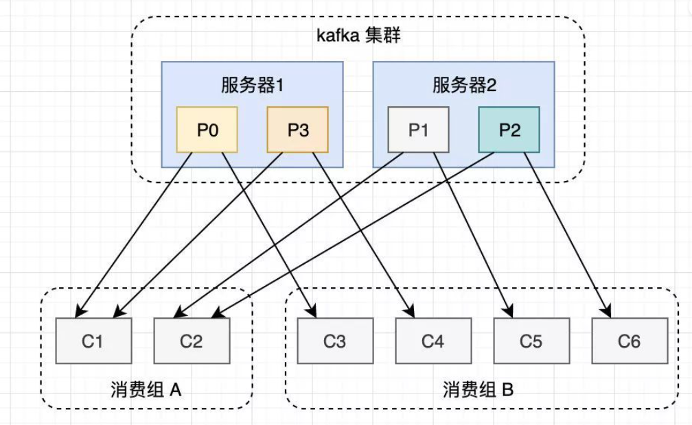
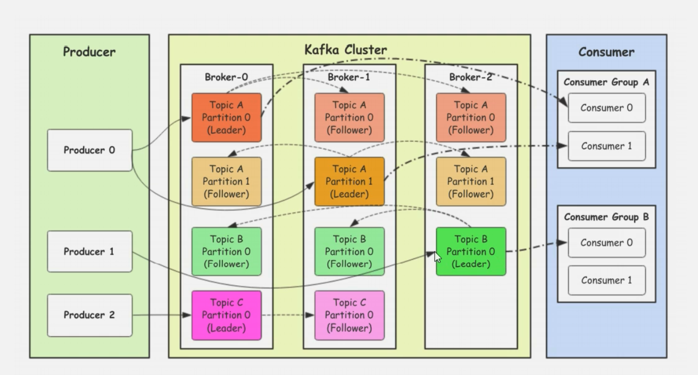

## Kafka-Cluster 的相关概念
- Broker： 部署了 Kafka 实例的节点
- Topic： 消息的主题，可以理解成消息的分类，每个 Broker 上都可以创建多个 Topic
- Partition： Topic 的分区，每个 Topic 可以有多个分区，分区作用是负载，提高吞吐量，
一个 Topic 的不同分区的数据是不重复的，Partition 的表现形式是一个个文件夹

- Replication: 每个分区都有多个副本，当主分区（Leader）故障，会选择一个备胎（Follower）上位，成为 Leader。
在 Kafka 中，Replication 副本最大数量是 10 个，且不能超过 Broker 节点数量

## Kafka-Consumer 相关概念

- Consumer Group：将多个消费者，组成一个消费者组，在 Kafka 中，同一个分区（Partition）中的数据，
只能被一个 Consumer Group 中的一个消费者消费，同一个消费者组的消费者可以消费同一个 Topic 下的不同分区
，这样就可以提供高性能的吞吐量

## Kafka 发送数据的流程

## Kafka 选择分区的模式
- 指定往哪个分区写 
- 指定 key，Kafka 根据 key 做 hash 然后决定写入哪个分区 
- 轮询模式

## 生产者向 Kafka 发s送数据的模式（ACK机制）
- 0 把数据发送给 leader 就算发送成功 
- 1 把数据发送给 leader，等待 leader 返回 ACK，才算发送成功 
- all 把数据发送给 leader，follower 从 leader 拉取数据后返回给 leader 一个 ACK, leader 再返回给生产者，才算发送成功
