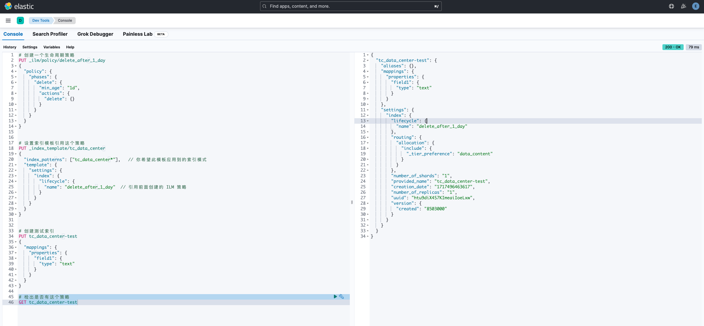

https://blog.csdn.net/qq_26664043/article/details/136060484


索引的生命周期主要有 hot /warm / cold / delete 四个阶段，我们当前需求比较简单，保留 Elasticsearch 中 30 天的日志，那么 30 天后 Delete 即可

> 先做一个生命周期策略

```bash
# 创建一个生命周期策略
PUT _ilm/policy/delete_after_1_day
{
  "policy": {
    "phases": {
      "delete": {
        "min_age": "1d",
        "actions": {
          "delete": {}
        }
      }
    }
  }
}
```

> 设置索引模板，引用这个策略


```bash
# 设置索引模板引用这个策略
PUT _index_template/tc_data_center
{
  "index_patterns": ["tc_data_center*"],   // 你希望此模板应用到的索引模式
  "template": {
    "settings": {
      "index": {
        "lifecycle": {
          "name": "delete_after_1_day"  // 引用前面创建的 ILM 策略
        }
      }
    }
  }
}
# 上面的格式不行了先不管了，用下面的
PUT _index_template/rov-octopus
{
  "index_patterns": ["rov_octopus*"],    
  "template": {  
    "settings": {
      "index.lifecycle.name": "delete_after_7_day"  
    }
  }
}

```

> 创建一个新的测试索引，已经存在的索引已经被创建，不会被影响

```
# 创建测试索引
PUT tc_data_center-test
{
  "mappings": {
    "properties": {
      "field1": {
        "type": "text"
      }
    }
  }
}
```

> 检查生命周期策略

```bash
# 检出是否有这个策略
GET tc_data_center-test
```




