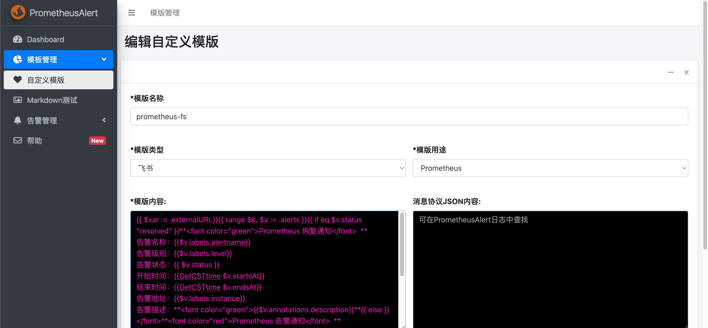
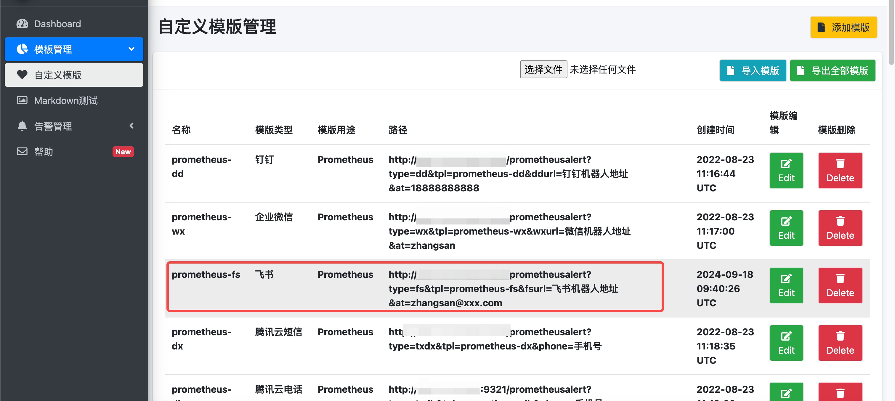
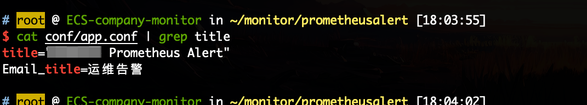
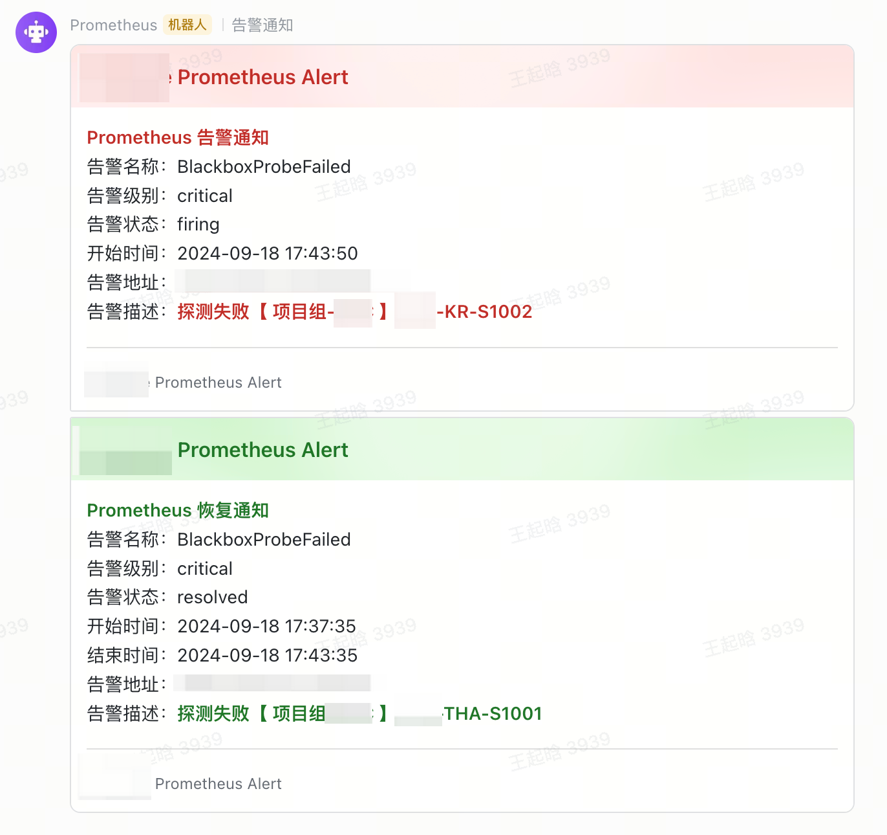
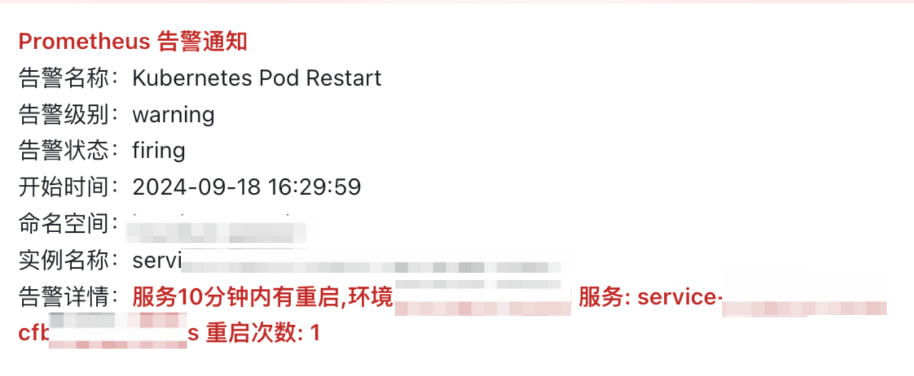

模板：
```bash
{{ $var := .externalURL}}{{ range $k, $v := .alerts }}{{ if eq $v.status "resolved" }}**<font color="green">Prometheus 恢复通知</font>  **
告警名称：{{$v.labels.alertname}}
告警级别：{{$v.labels.level}}
告警状态：{{ $v.status }}
开始时间：{{GetCSTtime $v.startsAt}}
结束时间：{{GetCSTtime $v.endsAt}}
告警地址：{{$v.labels.instance}}
告警描述：**<font color="green">{{$v.annotations.description}}**{{ else }}</font>**<font color="red">Prometheus 告警通知</font>  **
告警名称：{{$v.labels.alertname}}
告警级别：{{$v.labels.level}}
告警状态：{{ $v.status }}
开始时间：{{GetCSTtime $v.startsAt}}
告警地址：{{$v.labels.instance}}
告警描述：**<font color="red">{{$v.annotations.description}}</font>**{{ end }}{{ end }}
```

配置好后保存


可以看到当前模板的 URL，这个 URL 要配置在 alertmanager 里面



alertmanager 中配置通知 webhook 地址为 prometheusalert 地址

```yaml
global:
  resolve_timeout: 5m
  # 飞书服务器
  smtp_smarthost: 'smtp.feishu.cn:465'
  # 发邮件的邮箱
  smtp_from: 'devops@xxx.com'
  # 发邮件的邮箱用户名
  smtp_auth_username: 'devops@xxx.com'
  # 发邮件的邮箱密码
  smtp_auth_password: 'xxxxxxxxxxxxx'
  # 进行 tls 验证
  smtp_require_tls: false

route:
  group_by: ['instance']
  group_wait: 60s
  group_interval: 120s
  repeat_interval: 60m
  # 默认的接收器
  receiver: 'web.hook.prometheusalert'
  # 子路由，根据告警的标签分派到不同的接收器
  routes:
  # 当告警标签 Online=true  时，发送到到 Prometheus-online 飞书群
  - match:
      Online: "true"
    receiver: 'online'
    group_wait: 30s
    group_interval: 60s
    repeat_interval: 10m
    continue: true # 即发送 webhook 也发送 email
  - match:
      Online: "true"
    receiver: 'email'
    group_wait: 30s
    group_interval: 60s
    repeat_interval: 10m
# 其他路由暂时省略

receivers:
- name: 'web.hook.prometheusalert'
  webhook_configs:
  - url: 'http://prometheusalert:8080/prometheusalert?type=fs&tpl=prometheus-fs&fsurl=https://open.feishu.cn/open-apis/bot/v2/hook/xxxxxxxxx'
  - url: 'http://prometheusalert:8080/prometheusalert?type=fs&tpl=prometheus-fs&fsurl=https://open.feishu.cn/open-apis/bot/v2/hook/aaaaaa?sign=bbbbbb'

- name: 'online'
  webhook_configs:
  - url: 'http://prometheusalert:8080/prometheusalert?type=fs&tpl=prometheus-fs&fsurl=https://open.feishu.cn/open-apis/bot/v2/hook/cccccccccc'

- name: 'email'
  email_configs:
  - to: 'wangqihan@xxxxx.com'
    send_resolved: true
  - to: 'xxxxx@xxxxxx.com'
    send_resolved: true
```


告警标题：



告警通知：



Kubernetes 环境下的告警模板：

```bash
{{ $externalURL := .externalURL -}}
{{ $alerts := .alerts -}}

{{ range $alert := $alerts -}}
  {{ $groupKey := printf "%s|%s" $alert.labels.alertname $alert.status -}}
  {{ if eq $alert.status "resolved" -}}
</font>**<font color="green">Prometheus 告警通知</font>  **
告警名称：{{ $alert.labels.alertname }} 
告警级别：{{ $alert.labels.severity }} 
告警状态：{{ $alert.status }}
开始时间：{{ GetCSTtime $alert.startsAt }} 
结束时间：{{ GetCSTtime $alert.endsAt }} 
命名空间：{{ $alert.labels.namespace }} 
实例名称：{{ $alert.labels.pod }}
告警详情：**<font color="green">{{ $alert.annotations.description }}**
  {{ else -}}
</font>**<font color="red">Prometheus 告警通知</font>  **
告警名称：{{ $alert.labels.alertname }} 
告警级别：{{ $alert.labels.severity }} 
告警状态：{{ $alert.status }}
开始时间：{{ GetCSTtime $alert.startsAt }} 
命名空间：{{ $alert.labels.namespace }} 
实例名称：{{ $alert.labels.pod }}
告警详情：**<font color="red">{{ $alert.annotations.description }}</font>**
  {{ end -}}
{{ end -}}
```

通知效果如下： 



