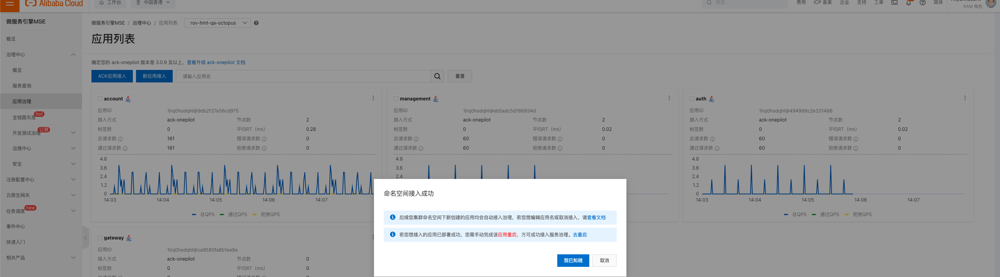

存一下参考链接


## SLS 开发相关
https://help.aliyun.com/zh/sls/user-guide/paged-query?spm=5176.28426678.J_HeJR_wZokYt378dwP-lLl.138.15735181k0uzvY&scm=20140722.S_help@@%E6%96%87%E6%A1%A3@@89994.S_RQW@ag0+BB2@ag0+BB1@ag0+os0.ID_89994-RL_sls%E6%97%A5%E5%BF%97%E6%9C%8D%E5%8A%A1%E5%88%86%E9%A1%B5%E6%98%BE%E7%A4%BA%E6%9F%A5%E8%AF%A2%E5%88%86%E6%9E%90%E7%BB%93%E6%9E%9C-LOC_search~UND~helpdoc~UND~item-OR_ser-V_3-P0_0
https://help.aliyun.com/zh/sls/developer-reference/get-started-with-log-service-sdk-for-go?spm=a2c4g.11186623.0.0.7c476e1bovY8Tg


清理 docker 
 /usr/bin/docker system prune --all
 /usr/bin/docker image prune -f
 find /data/docker/containers -type f -size +10M -name "*-json.log" -exec sh -c 'echo "" > {}' \;

## ES 配置建议
https://www.elastic.co/guide/en/elasticsearch/guide/master/heap-sizing.html
[Elasticsearch:我的 Elasticsearch 集群中应该有多少个分片?_elasticsearch 分片数过多-CSDN博客](https://elasticstack.blog.csdn.net/article/details/125715198)


阿里云 ACK 网络
Datapath v2 可以让访问 Service 之间的通信链路更短


多账号 / 多厂商的 ACK 互联，ACK one

https://www.alibabacloud.com/help/zh/ack/distributed-cloud-container-platform-for-kubernetes/user-guide/fleet-management-network-planning?spm=5176.28197752.console-base_help.dexternal.6ba56f0cXGNLqg
## 挂盘

```bash
#!/bin/bash

###仅适用于初次对该数据盘进行自动格式化添加

# 检查传入的参数数量
if [[ $# -ne 2 ]]; then
  echo "参数错误。请按照以下格式运行脚本："
  echo "  $0 <分区设备> <挂载目录>"
  echo "例如：$0 /dev/vdb /data"
  exit 1
fi

# 验证挂载目录格式
if [[ ! $2 =~ ^/[^[:cntrl:]]+ ]]; then
  echo "挂载目录格式错误。请使用绝对路径作为挂载目录，例如：/data"
  exit 1
fi

partition_device=$1
mount_directory=$2

if [[ ! -d $mount_directory ]]; then
  echo "挂载目录不存在。将创建该目录"
  mkdir $mount_directory -p
fi


# 查看云盘情况
fdisk -l

# 创建新分区
echo -e "n\np\n\n\n\nw" | fdisk $partition_device

# 格式化新分区
mkfs -t ext4 ${partition_device}1
if [[ $? -ne 0 ]]; then
  echo "格式化分区失败。"
  exit 1
fi
echo "分区 $partition_device 格式化成功。"


# 查看UUID
uuid=$(blkid -s UUID -o value ${partition_device}1)

if [[ -z $uuid ]]; then
  echo "未找到分区的UUID。"
  exit 1
fi
echo "分区的UUID为：$uuid"

# 写入开机自启挂载
echo "UUID=$uuid   $mount_directory ext4    defaults    0  0" >> /etc/fstab
if [[ $? -ne 0 ]]; then
  echo "写入开机自启挂载失败。"
  exit 1
fi
echo "开机自启挂载已成功添加。"

# 挂载
mount -a
if [[ $? -ne 0 ]]; then
  echo "挂载失败。"
  exit 1
fi
echo "挂载成功。"

# 确认查看挂载是否成功
df -h
```


简易备份
mysqldump -uxxxx -p -hxxxxxxxx.xxx.com --databases  global  --single-transaction  --set-gtid-purged=OFF > global-$(date +%Y%m%d).sql

不锁表备份
mysqldump -h rm-xxxxx.xxx.singapore.rds.aliyuncs.com -u online_admin -p --skip-lock-tables --single-transaction --databases game_xxx > game_xxx.sql


## MSE Nacos
https://help.aliyun.com/zh/mse/user-guide/access-authentication-by-nacos#3a1f4af4cdwze

MSE 



## 全球加速
按量收费模式是基于 CDT 的
另外全球加速，如果想结合 DDoS 模式，需要开通全局流量管理实例
文档：[https://help.aliyun.com/zh/ga/use-cases/accelerate-domain-names-hosted-outside-the-chinese-mainland?spm=a2c4g.11186623.help-menu-55629.d_3_2_3.892b30f4riQvGk&scm=20140722.H_164344._.OR_help-T_cn#DAS#zh-V_1](https://help.aliyun.com/zh/ga/use-cases/accelerate-domain-names-hosted-outside-the-chinese-mainland?spm=a2c4g.11186623.help-menu-55629.d_3_2_3.892b30f4riQvGk&scm=20140722.H_164344._.OR_help-T_cn#DAS#zh-V_1)


SLS SQL

```bash
* | SELECT request_uri, http_host, status, COUNT(*) AS error_count FROM log WHERE request_uri LIKE '%account%' AND status >= 500 AND status < 600 GROUP BY request_uri, http_host, status

select host,request_uri,status,count(*) from log where host = 'ror.gnjoy.hk' and request_uri = '/ROR24Xmas' group by host,request_uri,status
```


iLogtail 相关配置/日志

https://help.aliyun.com/zh/sls/user-guide/logtail-configuration-files-and-record-files?spm=a2c4g.11186623.help-menu-28958.d_2_1_1_2_1.5cd23285x3wcDZ&scm=20140722.H_91484._.OR_help-T_cn#DAS#zh-V_1


/var/lib/docker 空间清理
find /var/lib/docker/ -type f -size +1M -name "*-json.log" -exec sh -c 'echo "" > {}' \; 
/usr/bin/docker system prune --volumes -f


# MSE RAM

```
{ "Version": "1", "Statement": [ { "Action": [ "mse:Query*", "mse:List*", "mse:Get*" ], "Resource": "*", "Effect": "Allow" }, { "Action": "ram:CreateServiceLinkedRole", "Resource": "*", "Effect": "Allow", "Condition": { "StringEquals": { "ram:ServiceName": "[mse.aliyuncs.com](http://mse.aliyuncs.com)" } } } ] }
```


# 跨账号迁移服务 

- 新 K8S 中的服务，和旧 K8S 的服务，连接同一个 RDS / Redis（旧账号的），将 DNS 域名解析切换到新的 K8S 的 ALB，DNS 解析有 TTL，用户本地有 DNS 缓存，需要等段时间继续下面操作
- 观察旧的 ALB 访问日志没有正常业务流量以后，可以释放掉旧 K8S 的服务 / ALB
- 通过 DTS 将数据库做同步到新账号的 RDS / Redis
- 选择一个时间点，将旧 RDS 账号设置为只读，同时将新 RDS 设置为读写，并更改业务连接数据库地址，kubectl rollout restart 即可
- 因为数据一致性的问题，无法避免数据库纬度的短暂不可写的情况