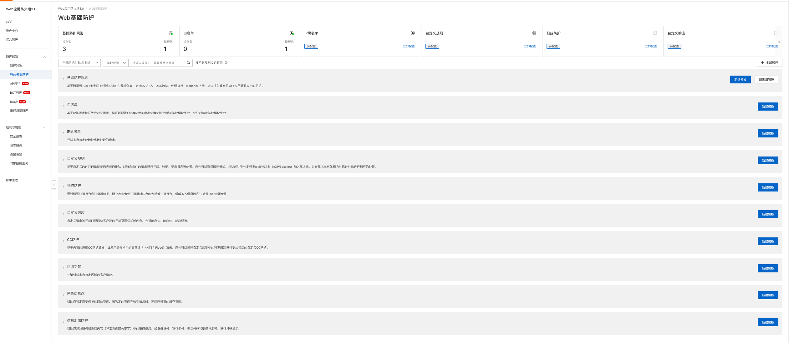

CC攻击（Challenge Collapsar Attack），通常被称为 HTTP 洪水攻击或 HTTP 慢速攻击，是 DDoS（ 分布式拒绝服务攻击 ）攻击的一种变种。它通过模拟大量正常用户对网站发送请求，消耗站点资源直至其无法响应，导致合法用户的访问请求被拒绝。  
### CC 攻击的特点

1. 请求量不是特别巨大但也不小：与大规模流量的 DDoS 攻击不同，CC 击中的请求量通常不会达到瞬间淹没网络设施的程度，但仍足以使网站的服务性能下降。

1. 模拟正常用户流量：CC 攻击通过模拟正常用户的 HTTP 请求来难以被检测和过滤，因为它遵循相同的 HTTP 协议。一些高级的 CC 攻击甚至可以模拟浏览器行为、改变请求头部、Cookies、User-Agent等，以绕过防护措施。

1. 针对性：CC 攻击常常针对 Web 应用程序，尤其是那些没有足够资源来承载大量请求的小型网站或应用。

  
### CC 攻击 vs DDoS 攻击  

1. 流量量级：DDoS 攻击常常表现为巨量的流量，促使从带宽层面彻底淹没目标；而 CC 攻击虽然请求量大但没有 DDoS 攻击那么极限，其主要影响是服务器资源被耗尽。

1. 攻击原理：CC 攻击主要是通过发起大量看上去“合法”的请求压垮 Web 服务器处理能力；DDoS 攻击可能包括多种不同类型的流量攻击，例如 SYN Flood、UDP Flood 等。

1. 防护难点：CC 攻击因为模拟真实的用户请求，防御起来比较困难，需要能够区分正常请求和攻击请求；DDoS 攻击由于数据量巨大，通常是在网络层面被防护和清洗。

### CC 攻击 vs WAF

1. 防护针对性：WAF专注于防护Web应用层面的攻击，如SQL注入、XSS 等；CC 攻击针对的是 Web 服务器的负载能力。阿里云 WAF 中包括了 CC 攻击的防御功能。

1. 过滤手段：WAF 利用的安全规则和代码行为分析来防护攻击；对于 CC 攻击，简单的防火墙和过滤规则往往不足以防御，需要应用更复杂的流量分析和请求速率限制。

总的来说，CC 攻击是一种侧重于 Web 层面的、规模相对适中的 DDoS 攻击形式，它比典型的 DDoS 攻击更为隐蔽，并且比一般的 Web 应用安全问题（ WAF 防护对象 ）更加针对服务可用性。对 CC 攻击的有效防护需要结合应用层面的抗 DDoS 策略和针对 Web 流量行为进行针对性识别与控制的技术。

### 阿里云 WAF

