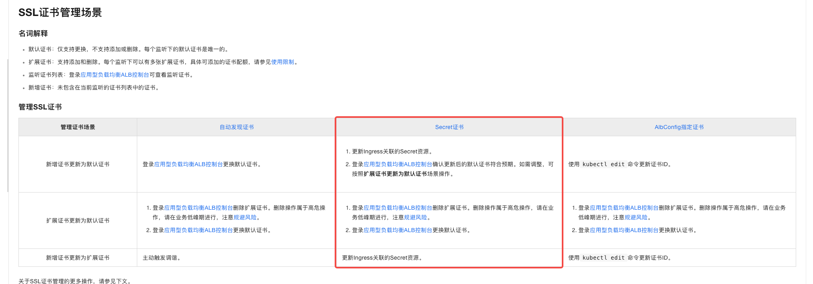
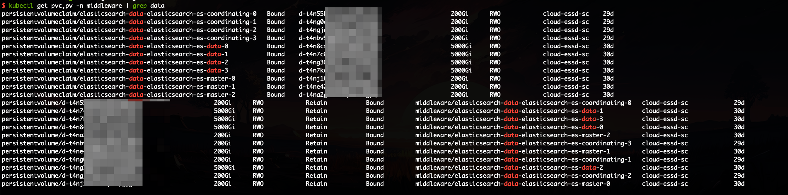
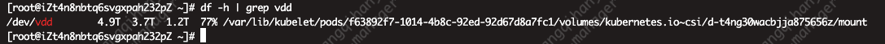

1. 证书快过期了，ALB Ingress 的替换证书操作流程？
- 直接更新 Kubernetes secret 即可，ALB 会自动调谐，更新 TLS 证书（前提是使用 secret 维护证书）
https://help.aliyun.com/zh/ack/ack-managed-and-ack-dedicated/user-guide/manage-ssl-certificates-for-https-listeners?spm=a2c4g.11186623.0.i9



2. 节点池中根据 IP 做节点下线过程中是否会有新节点加入？（下线过程是否会受节点池期望节点数影响）
-  ACK 节点池根据 IP 下线节点，可以直接执行，排水 + 下线即可，不会因为节点池设置的节点期望数量，导致下线后新加入节点

3. ESSD StorageClass 自动创建的 PV 水位高于 85% 是否会导致 Pod 驱逐？
- 不会，其实只有根水位超过 85% 时，才会导致 Pod 被驱逐，有这个疑问，是因为 ESSD StorageClass 其实也是挂载云盘到 ECS 上的


4. ESSD StorageClass 创建的 PV 不可调度？
- ESSD 类型的 PV ，ACK 的实际做法，是挂载到 ECS 上的，因为本质就是个云盘
- 原因是付费类型改变成为了包年包月，如果需要重新跟着 StatefulSet 一起调度，改为按量付费，调度好以后，再调整为包年包月即可


5.   压测相关流程操作
```bash
# 使用 jmeter 工具压测，线程数 500，运行时间 30s
# /root/account-stress.jmx 是服务接口测试脚本（研发/测试给出）
# testx.jtl 是生成的结果文件
# ./jmeter_report 也是生成的压测报告，html 格式
jmeter -JThreadCount=500 -JRunTime=30 -n -t /root/account-stress.jmx -l testx.jtl -e -o ./jmeter_report
```
- 注意，如果 -JThreadCount 并发的线程数量很大，压测机器也需要 CPU 很高的配置，
- 但是 jmeter设置并发高，它也是要等到发出去的请求返回以后，才会继续发请求
- 一般观察图中的 Transation 值（ TPS ），算作服务的有效容量


